## Association rules
Describe an application of association rules method. In other words, discuss how you can derive association rules and then apply them to a specific situation.

*Answer:*
One area where association rules method is in healthcare, specifically in medical diagnosis and treatment recommendation systems. In this field, association rules can be derived from patient medical records and treatment outcomes. The data collected might include patient demographics (age, gender, ethnicity), medical history (pre-existing conditions, family history), symptoms, diagnostic test results, prescribed medications, and treatment outcomes.  

*Benefits:*  

* Improved Diagnosis Accuracy: Association rules can help healthcare providers make more accurate diagnoses by identifying subtle patterns in patient data that might not be immediately apparent.
* Personalized Treatment: By analyzing past treatment outcomes, association rules can enable personalized treatment recommendations tailored to individual patient characteristics, improving the effectiveness of healthcare interventions.
* Resource Allocation: Healthcare organizations can use association rules to allocate resources more efficiently by identifying high-risk patient populations and targeting interventions where they are most needed.

*Application:*  

* Medical Diagnosis: Association rules can be used to aid physicians in diagnosing medical conditions by identifying patterns in patient data.
* Treatment Recommendation: Association rules can assist healthcare providers in recommending appropriate treatments based on patient characteristics and medical history.  

*Potential Itemset Content:* It could be information of patients’ demographic, symptoms, medical histories, treatments, etc.
Example: Age: 45-60, Gender: Female, Pregnancies: 2, BloodPressure: 75, BMI: 35, Glucose: 148, Diagnosis: Diabetes Type 2.

## Neural network
### A. Describe the data set and provide a table with the learning rates, number of hidden layers and nodes per layer.  
The dataset contains 7 columns and 3642 rows, each corresponding to a different star, provides information about a specific star’s properties such as magnitude, color index, spectral type, and classification. Data source: Kaggle.  
*Column description:*  

*	Vmag: Visual magnitude is a measure of the brightness of a star as seen from Earth, with smaller values indicating brighter stars.
*	Plx: Parallax is a measurement technique used to determine the distance to nearby stars by observing their apparent shift in position as seen from different points in Earth’s orbit.
*	e_Plx: The error in the parallax measurements.
*	B_V: The B-V color index is a measure of a star's color, calculated as the difference in brightness between the B (blue) and V (visual) photometric bands.
*	SpType: Spectral type is a classification system based on the characteristics of a star’s spectrum, including the presence and strength of absorption lines.
*	Amag: Absolute magnitude is a measure of the intrinsic brightness of a star, defined as the apparent magnitude the star would have if it were located at a standard distance of 10 parsecs (about 32.6 light-years) from Earth.
*	TargetClass: This column indicates the classification of the stars as either 0 or 1, presumably representing giants and dwarfs respectively.


```r
#table with the learning rates, number of hidden layers and nodes per layer.
experiment = seq(1:8)
layer = c(1, 1, 2, 2, 1, 1, 2, 2)
node =  c(2, 3, 2, 3, 2, 3, 2, 3)
learning_rate = c(0.1, 0.1, 0.1, 0.1, 0.5, 0.5, 0.5, 0.5)

q6_df <- data.frame(experiment, layer, node, learning_rate)
q6_df
```

```
##   experiment layer node learning_rate
## 1          1     1    2           0.1
## 2          2     1    3           0.1
## 3          3     2    2           0.1
## 4          4     2    3           0.1
## 5          5     1    2           0.5
## 6          6     1    3           0.5
## 7          7     2    2           0.5
## 8          8     2    3           0.5
```


```r
#load data and modify a column name
library(readr)
star <- read_csv("/Users/trieutlh/Library/CloudStorage/OneDrive-UW/Archive/TBANLT 560/final exam/data/Star3642_balanced.csv")
colnames(star)[4] <- "B_V"
```


```r
head(star)
```

```
## # A tibble: 6 × 7
##    Vmag   Plx e_Plx    B_V SpType  Amag TargetClass
##   <dbl> <dbl> <dbl>  <dbl> <chr>  <dbl>       <dbl>
## 1  5.99 13.7   0.58  1.32  K5III   16.7           0
## 2  8.7   2.31  1.29 -0.045 B1II    15.5           0
## 3  5.77  5.5   1.03  0.855 G5III   14.5           0
## 4  6.72  5.26  0.74 -0.015 B7V     15.3           1
## 5  8.76 13.4   1.16  0.584 G0V     19.4           1
## 6  4.9   8.37  0.76 -0.091 B9III   14.5           0
```

```r
summary(star)
```

```
##       Vmag             Plx              e_Plx             B_V         
##  Min.   : 0.450   Min.   : -6.820   Min.   : 0.470   Min.   :-0.1960  
##  1st Qu.: 7.370   1st Qu.:  2.740   1st Qu.: 0.840   1st Qu.: 0.4873  
##  Median : 8.390   Median :  4.950   Median : 1.040   Median : 0.8670  
##  Mean   : 8.121   Mean   :  7.606   Mean   : 1.177   Mean   : 0.8271  
##  3rd Qu.: 9.060   3rd Qu.:  8.670   3rd Qu.: 1.270   3rd Qu.: 1.1360  
##  Max.   :12.490   Max.   :280.270   Max.   :30.290   Max.   : 2.5300  
##     SpType               Amag        TargetClass 
##  Length:3642        Min.   : 2.82   Min.   :0.0  
##  Class :character   1st Qu.:15.15   1st Qu.:0.0  
##  Mode  :character   Median :16.39   Median :0.5  
##                     Mean   :16.43   Mean   :0.5  
##                     3rd Qu.:18.03   3rd Qu.:1.0  
##                     Max.   :29.25   Max.   :1.0
```


```r
# partition  to create the training and validation
set.seed(1)
train.index <- sample(row.names(star), 0.6*dim(star)[1])  
valid.index <- setdiff(row.names(star), train.index)  
train.df <- star[train.index, ]
valid.df <- star[valid.index, ]

# normalize
library(caret)
```

```
## Loading required package: ggplot2
```

```
## Loading required package: lattice
```

```r
norm.values <- preProcess(train.df, method="range")
# generate the normalized training and validation 
train.norm.df <- predict(norm.values, train.df)
valid.norm.df <- predict(norm.values, valid.df)
```


```r
library(neuralnet)

file_path <- "/Users/trieutlh/Library/CloudStorage/OneDrive-UW/Archive/TBANLT 560/final exam/figures/q6"
#Experiment 1: 1 layer with 2 nodes, learning rate = 0.1
nn <- neuralnet(TargetClass ~ Vmag+
                  Plx+
                  e_Plx+
                  B_V+
                  Amag, 
                data = train.norm.df, linear.output = T, 
                hidden = 2,
                learningrate = 0.1,
                stepmax=1e+06)
q6_g1 <- plot(nn, rep = "best")
```

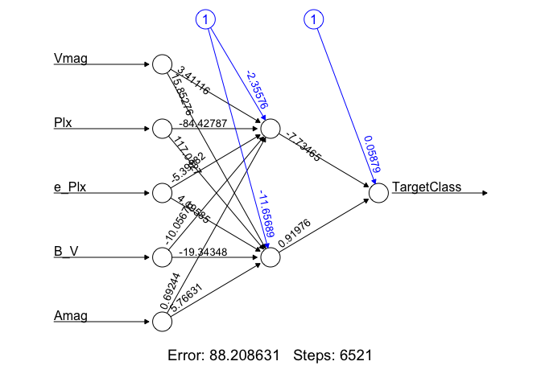<!-- -->

```r
ggsave(file=file.path(file_path, "q6_g1.png"),
       q6_g1, width=5, height=8, units="in")

#use compute function for nn to get the prediction
training.prediction <- neuralnet::compute(nn, train.norm.df)

#examine the result matrix
nn$result.matrix
```

```
##                                   [,1]
## error                     8.820863e+01
## reached.threshold         7.948528e-03
## steps                     6.521000e+03
## Intercept.to.1layhid1    -2.355756e+00
## Vmag.to.1layhid1          3.411161e+00
## Plx.to.1layhid1          -8.442787e+01
## e_Plx.to.1layhid1        -5.399817e+00
## B_V.to.1layhid1          -1.005676e+01
## Amag.to.1layhid1          6.924434e-01
## Intercept.to.1layhid2    -1.165689e+01
## Vmag.to.1layhid2          1.585276e+01
## Plx.to.1layhid2           1.170127e+02
## e_Plx.to.1layhid2         4.195847e+00
## B_V.to.1layhid2          -1.934348e+01
## Amag.to.1layhid2          5.766309e+00
## Intercept.to.TargetClass  5.879344e-02
## 1layhid1.to.TargetClass  -7.734653e+00
## 1layhid2.to.TargetClass   9.197638e-01
```

```r
#predictions on validation data
validation.prediction=neuralnet::compute(nn, valid.norm.df)

#table(unlist(validation.prediction))
#plot.new()
hist(unlist(validation.prediction))
```

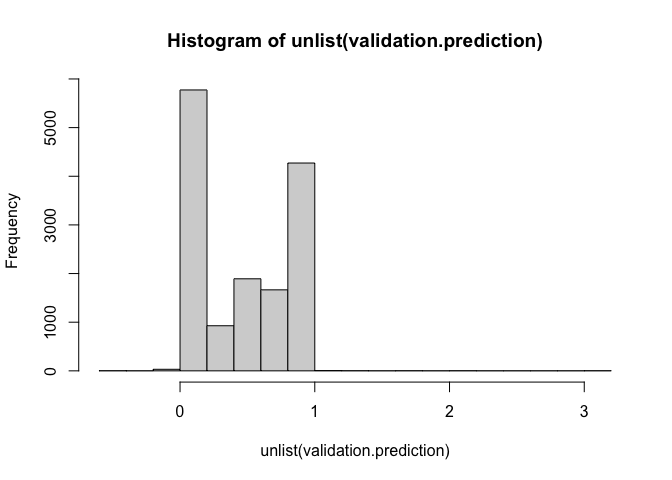<!-- -->

```r
library(forecast)
#prediction error of training data
q6_result_1t <- round(accuracy(unlist(training.prediction), train.norm.df$TargetClass),4)
#prediction error of validation data
q6_result_1v <- round(accuracy(unlist(validation.prediction), valid.norm.df$TargetClass),4)
```


```r
#Experiment 2: 1 layer with 3 nodes, learning rate = 0.1
nn <- neuralnet(TargetClass ~ Vmag+
                  Plx+
                  e_Plx+
                  B_V+
                  Amag, 
                data = train.norm.df, linear.output = T, 
                hidden = 3,
                learningrate = 0.1,
                stepmax=1e+06)
q6_g2 <- plot(nn, rep = "best")
```

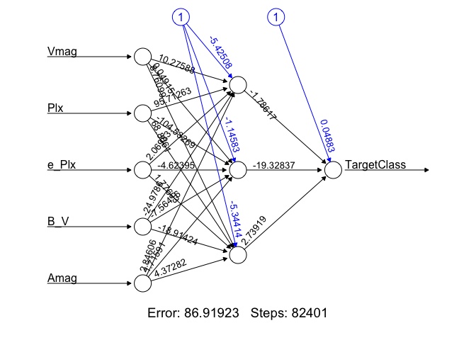<!-- -->

```r
ggsave(file=file.path(file_path, "q6_g2.png"),
       q6_g2, width=5, height=8, units="in")
#use compute function for nn to get the prediction
training.prediction <- neuralnet::compute(nn, train.norm.df)

#examine the result matrix
nn$result.matrix
```

```
##                                   [,1]
## error                     8.691923e+01
## reached.threshold         9.756637e-03
## steps                     8.240100e+04
## Intercept.to.1layhid1    -5.425075e+00
## Vmag.to.1layhid1          1.027588e+01
## Plx.to.1layhid1           9.571263e+01
## e_Plx.to.1layhid1         2.069834e+00
## B_V.to.1layhid1          -2.497860e+01
## Amag.to.1layhid1          2.846063e+00
## Intercept.to.1layhid2    -1.145832e+00
## Vmag.to.1layhid2          4.914914e-02
## Plx.to.1layhid2          -1.045327e+02
## e_Plx.to.1layhid2        -4.623948e+00
## B_V.to.1layhid2          -7.564163e+00
## Amag.to.1layhid2          1.715908e+00
## Intercept.to.1layhid3    -5.344142e+00
## Vmag.to.1layhid3          8.760989e+00
## Plx.to.1layhid3           6.880610e+01
## e_Plx.to.1layhid3         1.776028e+00
## B_V.to.1layhid3          -1.891424e+01
## Amag.to.1layhid3          4.372825e+00
## Intercept.to.TargetClass  4.882517e-02
## 1layhid1.to.TargetClass  -1.786167e+00
## 1layhid2.to.TargetClass  -1.932837e+01
## 1layhid3.to.TargetClass   2.739188e+00
```

```r
#predictions on validation data
validation.prediction=neuralnet::compute(nn, valid.norm.df)

#table(unlist(validation.prediction))
#plot.new()
hist(unlist(validation.prediction))
```

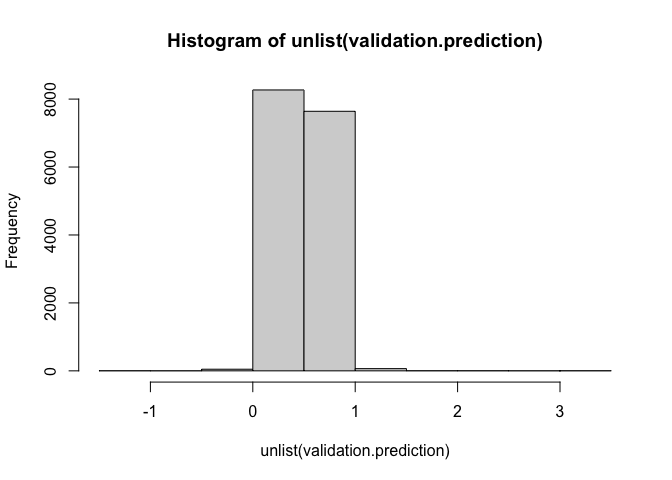<!-- -->

```r
library(forecast)
#prediction error of training data
q6_result_2t <- round(accuracy(unlist(training.prediction), train.norm.df$TargetClass),4)
#prediction error of validation data
q6_result_2v <- round(accuracy(unlist(validation.prediction), valid.norm.df$TargetClass),4)
```


```r
#Experiment 3: 2 layers with 2 nodes each layer, learning rate = 0.1
nn <- neuralnet(TargetClass ~ Vmag+
                  Plx+
                  e_Plx+
                  B_V+
                  Amag, 
                data = train.norm.df, linear.output = F, 
                hidden = c(2,2),
                learningrate = 0.1,
                stepmax=1e+06)
q6_g3 <- plot(nn, rep = "best")
```

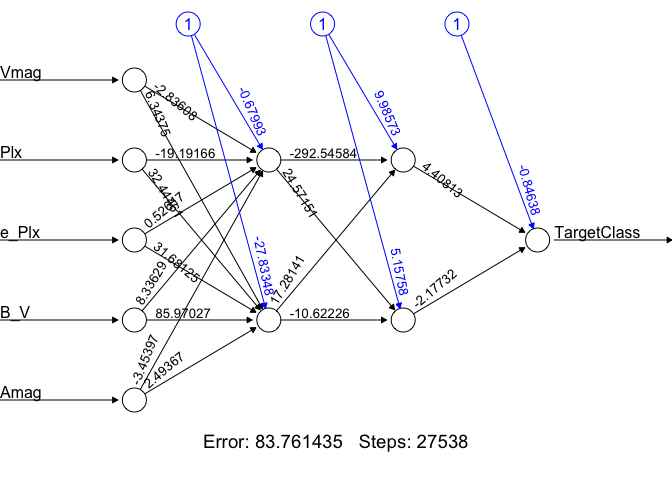<!-- -->

```r
ggsave(file=file.path(file_path, "q6_g3.png"),
       q6_g3, width=5, height=8, units="in")
#use compute function for nn to get the prediction
training.prediction <- neuralnet::compute(nn, train.norm.df)

#examine the result matrix
nn$result.matrix
```

```
##                                   [,1]
## error                     8.376144e+01
## reached.threshold         9.991151e-03
## steps                     2.753800e+04
## Intercept.to.1layhid1    -6.799305e-01
## Vmag.to.1layhid1         -2.836084e+00
## Plx.to.1layhid1          -1.919166e+01
## e_Plx.to.1layhid1         5.261705e-01
## B_V.to.1layhid1           8.336290e+00
## Amag.to.1layhid1         -3.453968e+00
## Intercept.to.1layhid2    -2.783348e+01
## Vmag.to.1layhid2          6.343754e+00
## Plx.to.1layhid2           3.244461e+01
## e_Plx.to.1layhid2         3.168125e+01
## B_V.to.1layhid2           8.597027e+01
## Amag.to.1layhid2          2.493673e+00
## Intercept.to.2layhid1     9.985732e+00
## 1layhid1.to.2layhid1     -2.925458e+02
## 1layhid2.to.2layhid1      1.728141e+01
## Intercept.to.2layhid2     5.157581e+00
## 1layhid1.to.2layhid2      2.457151e+01
## 1layhid2.to.2layhid2     -1.062226e+01
## Intercept.to.TargetClass -8.463845e-01
## 2layhid1.to.TargetClass   4.408129e+00
## 2layhid2.to.TargetClass  -2.177317e+00
```

```r
#predictions on validation data
validation.prediction=neuralnet::compute(nn, valid.norm.df)

#table(unlist(validation.prediction))
#plot.new()
hist(unlist(validation.prediction))
```

<!-- -->

```r
library(forecast)
#prediction error of training data
q6_result_3t <- round(accuracy(unlist(training.prediction), train.norm.df$TargetClass),4)
#prediction error of validation data
q6_result_3v <- round(accuracy(unlist(validation.prediction), valid.norm.df$TargetClass),4)
```


```r
#Experiment 4: 2 layers with 3 nodes each layer, learning rate = 0.1
nn <- neuralnet(TargetClass ~ Vmag+
                  Plx+
                  e_Plx+
                  B_V+
                  Amag, 
                data = train.norm.df, linear.output = T, 
                hidden = c(3,3),
                learningrate = 0.1,
                stepmax=1e+06)
q6_g4 <- plot(nn, rep = "best")
```

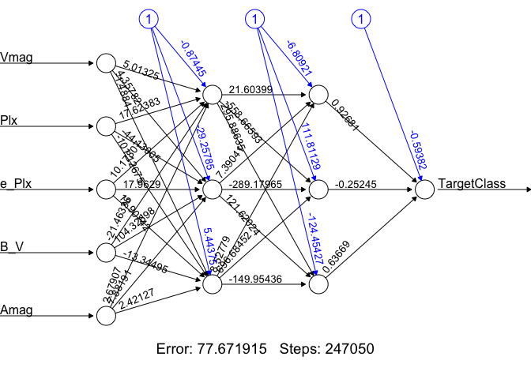<!-- -->

```r
ggsave(file=file.path(file_path, "q6_g4.png"),
       q6_g4, width=5, height=8, units="in")
#use compute function for nn to get the prediction
training.prediction <- neuralnet::compute(nn, train.norm.df)

#examine the result matrix
nn$result.matrix
```

```
##                                   [,1]
## error                     7.767192e+01
## reached.threshold         9.687331e-03
## steps                     2.470500e+05
## Intercept.to.1layhid1    -8.744452e-01
## Vmag.to.1layhid1          5.013251e+00
## Plx.to.1layhid1           1.762383e+01
## e_Plx.to.1layhid1         1.017807e+01
## B_V.to.1layhid1          -2.146336e+01
## Amag.to.1layhid1          2.679066e+00
## Intercept.to.1layhid2    -2.925785e+01
## Vmag.to.1layhid2          4.357817e+00
## Plx.to.1layhid2          -4.413005e+01
## e_Plx.to.1layhid2         1.796290e+01
## B_V.to.1layhid2           1.043270e+02
## Amag.to.1layhid2          7.881905e+00
## Intercept.to.1layhid3     5.443751e+00
## Vmag.to.1layhid3         -1.488402e+00
## Plx.to.1layhid3          -1.011268e+02
## e_Plx.to.1layhid3         1.290742e+01
## B_V.to.1layhid3          -1.334495e+01
## Amag.to.1layhid3          2.421271e+00
## Intercept.to.2layhid1    -6.809207e+00
## 1layhid1.to.2layhid1      2.160399e+01
## 1layhid2.to.2layhid1      7.390415e+00
## 1layhid3.to.2layhid1      8.527790e+00
## Intercept.to.2layhid2     1.118113e+02
## 1layhid1.to.2layhid2     -5.586659e+02
## 1layhid2.to.2layhid2     -2.891797e+02
## 1layhid3.to.2layhid2      6.966845e+02
## Intercept.to.2layhid3    -1.244543e+02
## 1layhid1.to.2layhid3      2.958864e+02
## 1layhid2.to.2layhid3      1.216202e+02
## 1layhid3.to.2layhid3     -1.499544e+02
## Intercept.to.TargetClass -5.938187e-01
## 2layhid1.to.TargetClass   9.268053e-01
## 2layhid2.to.TargetClass  -2.524479e-01
## 2layhid3.to.TargetClass   6.366863e-01
```

```r
#predictions on validation data
validation.prediction=neuralnet::compute(nn, valid.norm.df)

#table(unlist(validation.prediction))
#plot.new()
hist(unlist(validation.prediction))
```

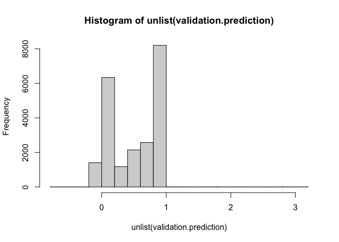<!-- -->

```r
library(forecast)
#prediction error of training data
q6_result_4t <- round(accuracy(unlist(training.prediction), train.norm.df$TargetClass),4)
#prediction error of validation data
q6_result_4v <- round(accuracy(unlist(validation.prediction), valid.norm.df$TargetClass),4)
```


```r
#Experiment 5: 1 layer with 2 nodes, learning rate = 0.5
nn <- neuralnet(TargetClass ~ Vmag+
                  Plx+
                  e_Plx+
                  B_V+
                  Amag, 
                data = train.norm.df, linear.output = T, 
                hidden = 2,
                learningrate = 0.5)
q6_g5 <- plot(nn, rep = "best")
```

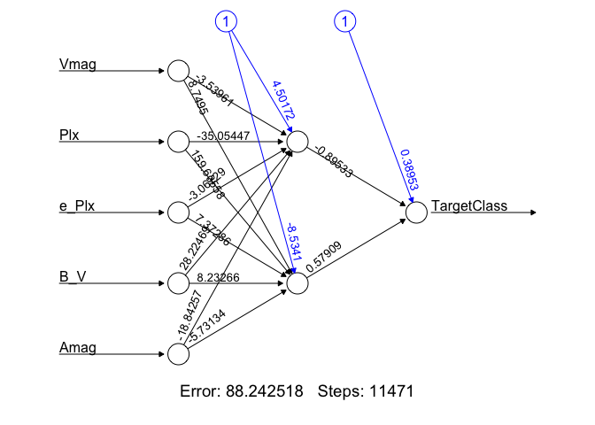<!-- -->

```r
ggsave(file=file.path(file_path, "q6_g5.png"),
       q6_g5, width=5, height=8, units="in")

#use compute function for nn to get the prediction
training.prediction <- neuralnet::compute(nn, train.norm.df)

#examine the result matrix
nn$result.matrix
```

```
##                                   [,1]
## error                     8.824252e+01
## reached.threshold         9.573068e-03
## steps                     1.147100e+04
## Intercept.to.1layhid1     4.501715e+00
## Vmag.to.1layhid1         -3.539609e+00
## Plx.to.1layhid1          -3.505447e+01
## e_Plx.to.1layhid1        -3.062294e+00
## B_V.to.1layhid1           2.822469e+01
## Amag.to.1layhid1         -1.884257e+01
## Intercept.to.1layhid2    -8.534102e+00
## Vmag.to.1layhid2          8.749505e+00
## Plx.to.1layhid2           1.596356e+02
## e_Plx.to.1layhid2         7.372862e+00
## B_V.to.1layhid2           8.232662e+00
## Amag.to.1layhid2         -5.731343e+00
## Intercept.to.TargetClass  3.895304e-01
## 1layhid1.to.TargetClass  -8.953264e-01
## 1layhid2.to.TargetClass   5.790864e-01
```

```r
#predictions on validation data
validation.prediction=neuralnet::compute(nn, valid.norm.df)

#table(unlist(validation.prediction))
#plot.new()
hist(unlist(validation.prediction))
```

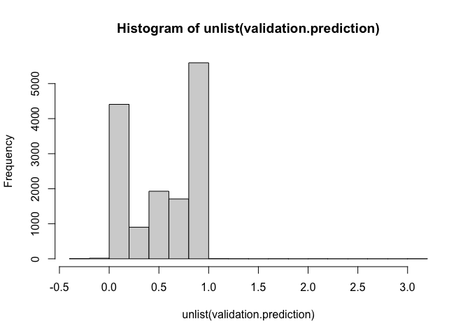<!-- -->

```r
library(forecast)
#prediction error of training data
q6_result_5t <- round(accuracy(unlist(training.prediction), train.norm.df$TargetClass),4)
#prediction error of validation data
q6_result_5v <- round(accuracy(unlist(validation.prediction), valid.norm.df$TargetClass),4)
```


```r
#Experiment 6: 1 layer with 3 nodes, learning rate = 0.5
nn <- neuralnet(TargetClass ~ Vmag+
                  Plx+
                  e_Plx+
                  B_V+
                  Amag, 
                data = train.norm.df, linear.output = T, 
                hidden = 3,
                learningrate = 0.5,
                stepmax=1e+06)
q6_g6 <- plot(nn, rep = "best")
```

<!-- -->

```r
ggsave(file=file.path(file_path, "q6_g6.png"),
       q6_g6, width=5, height=8, units="in")
#use compute function for nn to get the prediction
training.prediction <- neuralnet::compute(nn, train.norm.df)

#examine the result matrix
nn$result.matrix
```

```
##                                   [,1]
## error                     8.537621e+01
## reached.threshold         9.521880e-03
## steps                     5.996000e+04
## Intercept.to.1layhid1    -7.645607e+01
## Vmag.to.1layhid1          7.521070e+01
## Plx.to.1layhid1           1.456227e+03
## e_Plx.to.1layhid1         4.412984e+01
## B_V.to.1layhid1           1.228523e+02
## Amag.to.1layhid1         -9.555093e+01
## Intercept.to.1layhid2    -1.751167e+01
## Vmag.to.1layhid2          2.023924e+01
## Plx.to.1layhid2           2.150866e+02
## e_Plx.to.1layhid2         2.653560e+01
## B_V.to.1layhid2          -1.711761e+01
## Amag.to.1layhid2          2.570932e+00
## Intercept.to.1layhid3    -2.131090e+01
## Vmag.to.1layhid3          2.027560e+01
## Plx.to.1layhid3           1.999942e+02
## e_Plx.to.1layhid3         3.609560e+00
## B_V.to.1layhid3          -1.265981e+02
## Amag.to.1layhid3          7.686968e+01
## Intercept.to.TargetClass -1.714768e-01
## 1layhid1.to.TargetClass   2.241185e-01
## 1layhid2.to.TargetClass   3.378661e-01
## 1layhid3.to.TargetClass   5.747482e-01
```

```r
#predictions on validation data
validation.prediction=neuralnet::compute(nn, valid.norm.df)

#table(unlist(validation.prediction))
#plot.new()
hist(unlist(validation.prediction))
```

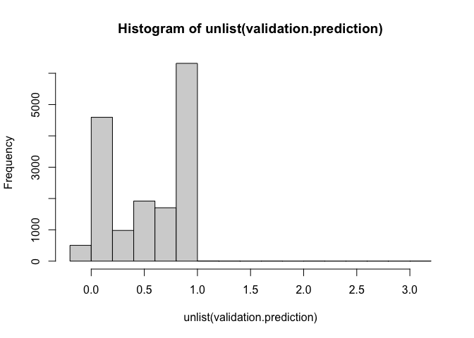<!-- -->

```r
library(forecast)
#prediction error of training data
q6_result_6t <- round(accuracy(unlist(training.prediction), train.norm.df$TargetClass),4)
#prediction error of validation data
q6_result_6v <- round(accuracy(unlist(validation.prediction), valid.norm.df$TargetClass),4)
```


```r
#Experiment 7: 2 layers with 2 nodes each layer, learning rate = 0.5
nn <- neuralnet(TargetClass ~ Vmag+
                  Plx+
                  e_Plx+
                  B_V+
                  Amag, 
                data = train.norm.df, linear.output = T, 
                hidden = c(2,2),
                learningrate = 0.5,
                stepmax=1e+06)
q6_g7 <- plot(nn, rep = "best")
```

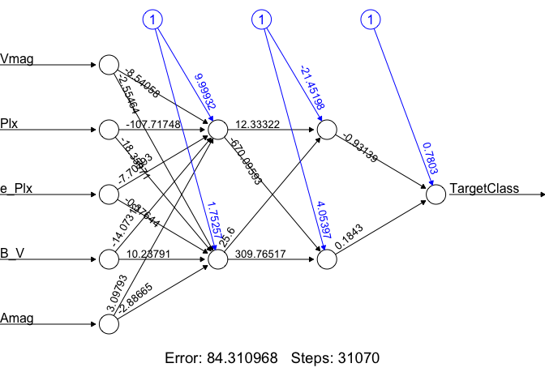<!-- -->

```r
ggsave(file=file.path(file_path, "q6_g7.png"),
       q6_g7, width=5, height=8, units="in")
#use compute function for nn to get the prediction
training.prediction <- neuralnet::compute(nn, train.norm.df)

#examine the result matrix
nn$result.matrix
```

```
##                                   [,1]
## error                     8.431097e+01
## reached.threshold         9.868820e-03
## steps                     3.107000e+04
## Intercept.to.1layhid1     9.999320e+00
## Vmag.to.1layhid1         -8.540576e+00
## Plx.to.1layhid1          -1.077175e+02
## e_Plx.to.1layhid1        -7.703929e+00
## B_V.to.1layhid1          -1.407313e+01
## Amag.to.1layhid1          3.097934e+00
## Intercept.to.1layhid2     1.752571e+00
## Vmag.to.1layhid2         -2.554641e+00
## Plx.to.1layhid2          -1.835971e+01
## e_Plx.to.1layhid2        -3.764374e-01
## B_V.to.1layhid2           1.023791e+01
## Amag.to.1layhid2         -2.886649e+00
## Intercept.to.2layhid1    -2.145198e+01
## 1layhid1.to.2layhid1      1.233322e+01
## 1layhid2.to.2layhid1      2.560000e+01
## Intercept.to.2layhid2     4.053971e+00
## 1layhid1.to.2layhid2     -6.700959e+02
## 1layhid2.to.2layhid2      3.097652e+02
## Intercept.to.TargetClass  7.803008e-01
## 2layhid1.to.TargetClass  -9.313934e-01
## 2layhid2.to.TargetClass   1.843042e-01
```

```r
#predictions on validation data
validation.prediction=neuralnet::compute(nn, valid.norm.df)

#table(unlist(validation.prediction))
#plot.new()
hist(unlist(validation.prediction))
```

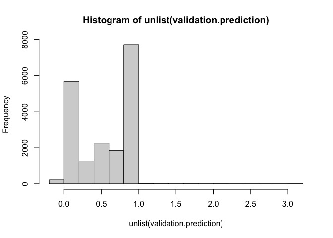<!-- -->

```r
library(forecast)
#prediction error of training data
q6_result_7t <- round(accuracy(unlist(training.prediction), train.norm.df$TargetClass),4)
#prediction error of validation data
q6_result_7v <- round(accuracy(unlist(validation.prediction), valid.norm.df$TargetClass),4)
```


```r
#Experiment 8: 2 layers with 3 nodes each layer, learning rate = 0.5
nn <- neuralnet(TargetClass ~ Vmag+
                  Plx+
                  e_Plx+
                  B_V+
                  Amag, 
                data = train.norm.df, linear.output = T, 
                hidden = c(3,3),
                learningrate = 0.5,
                stepmax=1e+06)
q6_g8 <- plot(nn, rep = "best")
```

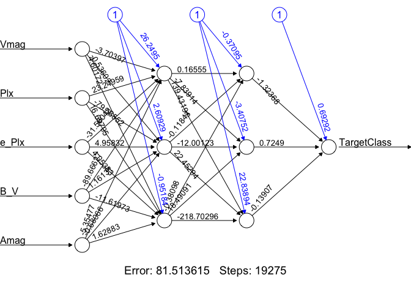<!-- -->

```r
ggsave(file=file.path(file_path, "q6_g8.png"),
       q6_g8, width=5, height=8, units="in")
#use compute function for nn to get the prediction
training.prediction <- neuralnet::compute(nn, train.norm.df)

#examine the result matrix
nn$result.matrix
```

```
##                                   [,1]
## error                     8.151361e+01
## reached.threshold         9.829789e-03
## steps                     1.927500e+04
## Intercept.to.1layhid1     2.624950e+01
## Vmag.to.1layhid1         -3.703969e+00
## Plx.to.1layhid1           2.324959e+01
## e_Plx.to.1layhid1        -3.156042e+01
## B_V.to.1layhid1          -8.966627e+01
## Amag.to.1layhid1         -5.354766e+00
## Intercept.to.1layhid2     2.609295e+00
## Vmag.to.1layhid2         -5.360203e-01
## Plx.to.1layhid2          -7.958552e+01
## e_Plx.to.1layhid2         4.958321e+00
## B_V.to.1layhid2           1.161308e+00
## Amag.to.1layhid2         -6.806574e-01
## Intercept.to.1layhid3    -9.518390e-01
## Vmag.to.1layhid3          4.601721e+00
## Plx.to.1layhid3           1.669795e+01
## e_Plx.to.1layhid3         4.053834e+00
## B_V.to.1layhid3          -1.161973e+01
## Amag.to.1layhid3          1.628832e+00
## Intercept.to.2layhid1    -3.709536e-01
## 1layhid1.to.2layhid1      1.655514e-01
## 1layhid2.to.2layhid1     -1.184294e-01
## 1layhid3.to.2layhid1     -3.809826e-01
## Intercept.to.2layhid2    -3.407521e+00
## 1layhid1.to.2layhid2     -7.839136e+00
## 1layhid2.to.2layhid2     -1.200123e+01
## 1layhid3.to.2layhid2      1.849091e+01
## Intercept.to.2layhid3     2.283894e+01
## 1layhid1.to.2layhid3      1.394319e+02
## 1layhid2.to.2layhid3      2.245294e+01
## 1layhid3.to.2layhid3     -2.187030e+02
## Intercept.to.TargetClass  6.929190e-01
## 2layhid1.to.TargetClass  -1.323680e+00
## 2layhid2.to.TargetClass   7.249019e-01
## 2layhid3.to.TargetClass  -1.390750e-01
```

```r
#predictions on validation data
validation.prediction=neuralnet::compute(nn, valid.norm.df)

#table(unlist(validation.prediction))
#plot.new()
hist(unlist(validation.prediction))
```

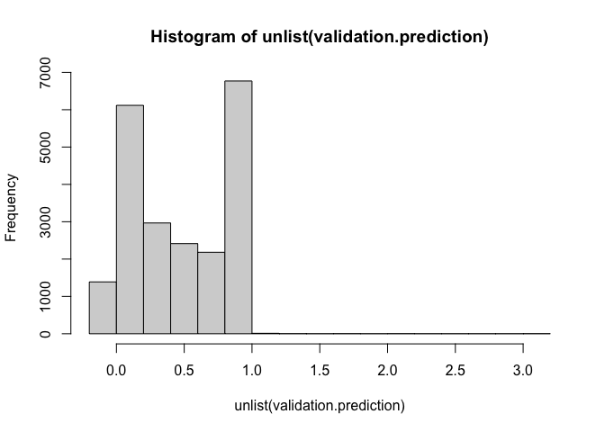<!-- -->

```r
library(forecast)
#prediction error of training data
q6_result_8t <- round(accuracy(unlist(training.prediction), train.norm.df$TargetClass),4)
#prediction error of validation data
q6_result_8v <- round(accuracy(unlist(validation.prediction), valid.norm.df$TargetClass),4)
```

### B. Results

```r
experiment_number <- c(1,1,2,2,3,3,4,4,5,5,6,6,7,7,8,8)
train_valid <- c("train", "valid")
q6_c <- as.data.frame(cbind(experiment_number, train_valid, rbind(q6_result_1t,
                                                          q6_result_1v,
                                                          q6_result_2t,
                                                          q6_result_2v,
                                                          q6_result_3t,
                                                          q6_result_3v,
                                                          q6_result_4t,
                                                          q6_result_4v,
                                                          q6_result_5t,
                                                          q6_result_5v,
                                                          q6_result_6t,
                                                          q6_result_6v,
                                                          q6_result_7t,
                                                          q6_result_7v,
                                                          q6_result_8t,
                                                          q6_result_8v
)))
rownames(q6_c) <- NULL
q6_c
```

```
##    experiment_number train_valid      ME   RMSE    MAE  MPE MAPE
## 1                  1       train -0.4961 0.7044 0.4961 -Inf  Inf
## 2                  1       valid -0.5058 0.7112 0.5058 -Inf  Inf
## 3                  2       train -0.4961 0.7044 0.4961 -Inf  Inf
## 4                  2       valid -0.5058 0.7112 0.5058 -Inf  Inf
## 5                  3       train -0.4961 0.7044 0.4961 -Inf  Inf
## 6                  3       valid -0.5058 0.7112 0.5058 -Inf  Inf
## 7                  4       train -0.4961 0.7044 0.4961 -Inf  Inf
## 8                  4       valid -0.5058 0.7112 0.5058 -Inf  Inf
## 9                  5       train -0.4961 0.7044 0.4961 -Inf  Inf
## 10                 5       valid -0.5058 0.7112 0.5058 -Inf  Inf
## 11                 6       train -0.4961 0.7044 0.4961 -Inf  Inf
## 12                 6       valid -0.5058 0.7112 0.5058 -Inf  Inf
## 13                 7       train -0.4961 0.7044 0.4961 -Inf  Inf
## 14                 7       valid -0.5058 0.7112 0.5058 -Inf  Inf
## 15                 8       train -0.4961 0.7044 0.4961 -Inf  Inf
## 16                 8       valid -0.5058 0.7112 0.5058 -Inf  Inf
```

### C. Compare the results and discuss the outcomes:  
From the result table, it seems like there are no significant differences in performance across different architectures and learning rates. Therefore, in this case, the choice of network architecture and learning rate may not have a substantial impact on the model's performance.
